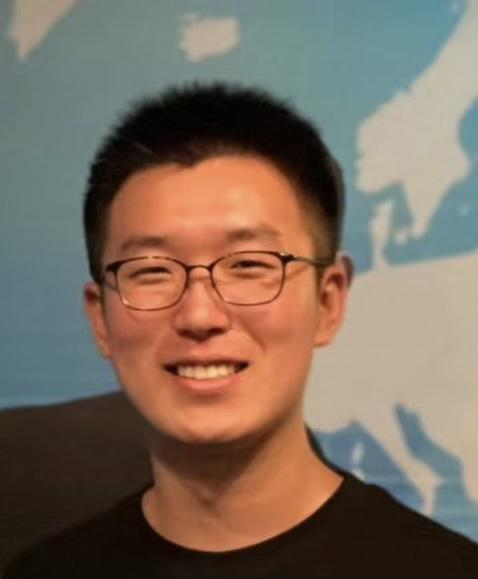

Hi. I am a junior student in Huazhong University of Science and Technology.

Email: Haoran Zhang
     
Phone: +86-15225936607
    
Date of birth: 4/14/2001
              
Address: Luoyu Road 1037, Wuhan, China

## Education
Huazhong University of Science and Technology(Honored Class)

Major: Automation

**GPA 3.91(90.0/100)** 

**IELTS:7.5(Reading:8.5 Listening:7.0 Writing:6.5 Speaking:7.0)**

## Research Interests
1. Computer Vision in biology and medical area including classification, segmentation and anomaly detection. 
2. AI theories and prevalent deep learning models including Transformer, RNN and CNN.

## Research Experience
### Transformer for 3D Medical Image Segmentation, HKUST(02/2022-Present)
1. Bettered the performance of Swin-Transformer by using multi-scale window self-attention.
2. Improved SwinUnet model in 3D medical image segmentation.

### DNA computing, HUST
1. Designed a 

## Beyond Research

### Volunteer, Defensing Covid-19 pandemic
1. Assisted the community

## Personal hobbies
1. I like playing badminton and table tennis. I learned how to play table tennis for over 2 years so I guess I am very good at it. 
2. I love animals and in holidays I really enjoy hiking or birding. 
3. I am also a gamer, playing Xbox and switch sometimes. My favorite game is The Legend of Zelda: Breath of the Wild.

